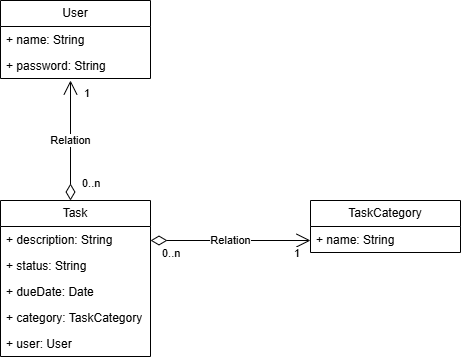

# Task Manager

A Spring Boot project developed during the Software Architecture in Java postgraduate course.

## Description

This is a demo project for Spring Boot, showcasing the development of a task management application using Java.

## Architecture Diagram



## Features

- RESTful API for task management
- Data persistence using JPA (Java Persistence API)
- In-memory H2 database for development and testing
- Lombok for reducing boilerplate code
- Spring Boot DevTools for enhanced development experience
- Internationalization support with message bundles
- Input validation with Bean Validation
- Model mapping with ModelMapper

## Prerequisites

- Java 17 or higher
- Maven 3.6 or higher

## Installation

1. Clone the repository:
   ```bash
   git clone <repository-url>
   cd taskmanager
   ```

2. Build the project:
   ```bash
   mvn clean install
   ```

## Running the Application

Run the application using Maven:
```bash
mvn spring-boot:run
```

The application will start on `http://localhost:8080`.

## Technologies Used

- **Spring Boot** 3.5.5
- **Java** 17
- **Spring Data JPA**
- **Spring Web**
- **H2 Database**
- **Lombok**
- **Bean Validation**
- **ModelMapper**
- **Maven**

## Data Models

### Task
- `id`: Integer (auto-generated primary key)
- `description`: String (required, 5-150 characters)
- `status`: TaskStatus enum (TO_DO, IN_PROGRESS, DONE)
- `dueDate`: LocalDate (must be future or present)
- `isVisible`: Boolean
- `category`: TaskCategory (required, many-to-one relationship)
- `user`: User (required, many-to-one relationship)

### TaskStatus
Enum with values:
- TO_DO
- IN_PROGRESS
- DONE

### Other Entities
- **TaskCategory**: Represents task categories (e.g., Work, Personal)
- **User**: Represents users who own tasks
- **Role**: User roles (e.g., ADMIN, USER)

## API Endpoints

The application provides RESTful endpoints for managing tasks. All endpoints return JSON responses.

### Retrieve All Tasks
- **GET** `/tasks`
- Description: Retrieves all tasks.
- Response: List of TaskResponse objects.

### Retrieve Tasks by Description
- **GET** `/tasks?description={description}`
- Description: Retrieves tasks filtered by description.
- Parameters: `description` (query parameter, string)
- Response: List of TaskResponse objects.

### Retrieve Task by ID
- **GET** `/tasks/{id}`
- Description: Retrieves a specific task by its ID.
- Parameters: `id` (path parameter, integer)
- Response: TaskResponse object.
- Error: 404 if task not found.

### Create a New Task
- **POST** `/tasks`
- Description: Creates a new task.
- Request Body: TaskRequest object (JSON)
- Response: TaskResponse object of the created task.
- Validation: Description must be 5-150 characters, due date must be future or present.

### Delete a Task
- **DELETE** `/tasks/{id}`
- Description: Deletes a task by its ID.
- Parameters: `id` (path parameter, integer)
- Response: 200 OK if successful.
- Error: 404 if task not found.

### Example Request for Creating a Task
```json
{
  "description": "Complete project documentation",
  "dueDate": "2023-12-31",
  "isVisible": true,
  "categoryId": 1,
  "userId": 1
}
```

## Testing

The project includes unit and integration tests using JUnit 5 and Spring Boot Test.

### Running Tests
Run all tests with Maven:
```bash
mvn test
```

### Test Coverage
- Integration tests for service layer (e.g., TaskServiceIntegrationTest)
- Repository tests for data access layer

## Contributing

Contributions are welcome! Please feel free to submit a Pull Request.

## License

This project is licensed under the MIT License.
